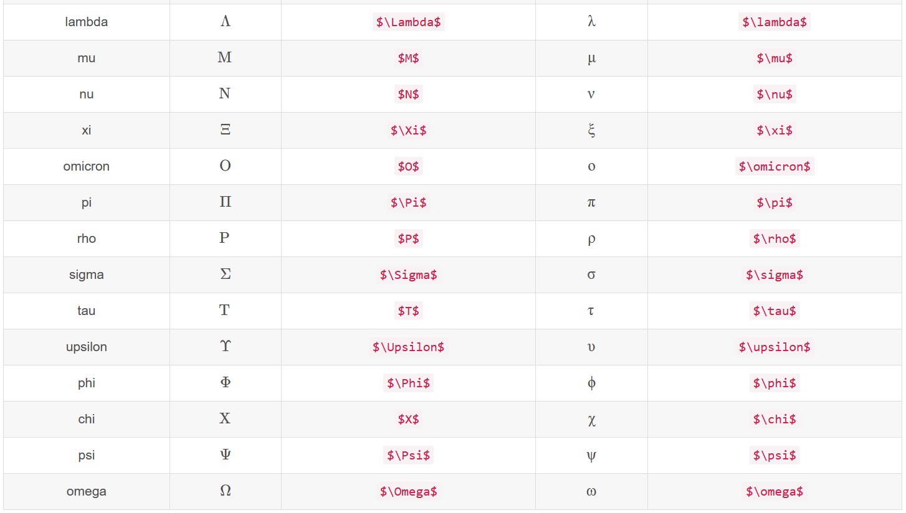
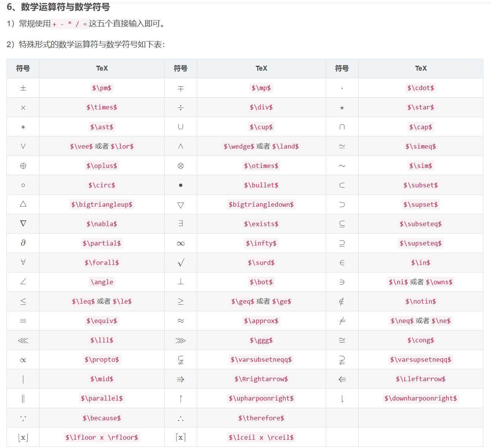

## `MarkDown`数学公式基本语法

0.公式换行,用"\\\\",转义字符后用{}或者空格避免二义性

1、公式排版

 MarkDown中公式公式的语法与LaTeX类似，排版可以分为两种：

    行内公式： 使用$包裹公式

注意：行内公式需要勾选偏好设置-Markdown-Markdown扩展语法-内联公式选项

例如：

\$E=mc^2\$   -->  $E=mc^2$

    独立公式： 使用$$包裹公式

例如：
$$
E=mc^2
$$


2、特殊转义字符

`$ & ~ _ ^ \ { } %`这些字符在MarkDown中有特殊的意义，在需要使用这些字符的时候，需要进行转义：

例如：`\#` --> #  `\$` -->$ `\&` --> &等等


3、希腊字母

|  名称   |   大写   |    Tex     |    小写    |  Tex   |
| :-----: | :------: | :--------: | :--------: | :----: |
|  alpha  |   $A$    |   `$A$`    |  $\alpha$  | \alpha |
|  beta   |   $B$    |   `$B$`    |  $\beta$   | \beta  |
|  gamma  | $\Gamma$ | `$\Gamma$` |  $\gamma$  |        |
|  delta  | $\Delta$ | `$\Delta$` |  $\delta$  |        |
| epsilon |   $E$    |   `$E$`    | $\epsilon$ |        |
|  zeta   |   $Z$    |   `$Z$`    |  $\zeta$   |        |
|   eta   |   $H$    |   `$H$`    |   $\eta$   |        |
|  theta  | $\Theta$ | `$\Theta$` |  $\theta$  |        |
|  iota   |   $I$    |   `$I$`    |  $\iota$   |        |
|  kappa  |   $K$    |   `$K$`    |  $\kappa$  |        |
|         |          |            |            |        |







10.分段函数

`&`表示对齐，`\\`用来表示换行，`\qquad`可以表示空格。

```
$$
函数名=\begin{cases}  
公式1 & 条件1 \\
公式2 & 条件2 \\
公式3 & 条件3 
\end{cases}
$$
```


11.大型数学运算符

极限可通过`\limits`和`\nolimits`命令显示制动是否压缩;

$\lim \limits_{n \to +\infty} \frac{n-1}{n(n+1)(n+2)}$

$\lim \nolimits_{n \to +\infty} \frac{n-1}{n(n+1)(n+2)}$

————————————————
版权声明：本文为CSDN博主「哦豁灬」的原创文章，遵循CC 4.0 BY-SA版权协议，转载请附上原文出处链接及本声明。
原文链接：https://blog.csdn.net/qq_38342510/article/details/124064158

